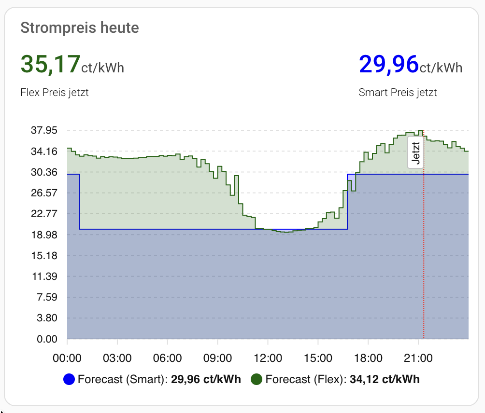

# WestfalenWind Strompreis

Diese Home-Assistant-Integration bindet die WestfalenWind-Stromtarife ein und stellt Forecast-Entitäten für die Tarife WWS Hochstift Smart und WWS Hochstift Flex bereit.

Die Integration steht in keiner Verbindung mit WestfalenWind.

## Für Nutzer

### Was die Integration bereitstellt

Nach der Einrichtung erscheinen zwei Sensoren in Home Assistant:

- WestfalenWind Smart Strompreis
- WestfalenWind Flex Strompreis

Beide Sensoren zeigen den Preis des aktuellen Intervalls in ct/kWh an. Damit eignen sie sich gut für Automationen, Dashboards und Preisvergleiche zwischen Smart und Flex.

Zusatzlich enthalten beide Entitäten diese Attribute:

- forecast: die geladenen Preisintervalle in komprimierter Form (Intervalle mit gleichem Preis zusammengefasst)
- entries: Anzahl der Forecast-Einträge
- refresh_schedule: die geplanten Abrufzeiten pro Tag

### Beispiel Visualisierung

Mit zum Beispiel [Apex Charts](https://github.com/RomRider/apexcharts-card) kann man den Preisverlauf für den aktuellen Tag visualisieren:



<details>

<summary>Code für die Visualisierung</summary>

``` yaml
type: custom:apexcharts-card
header:
  title: Strompreis heute
  show: true
  show_states: true
  colorize_states: true
apex_config:
  chart:
    height: 300px
  tooltip:
    enabled: true
    shared: true
    followCursor: true
  annotations:
    xaxis:
      - x: EVAL:Date.now()
        borderColor: red
        label:
          text: Jetzt
          position: top
          borderWidth: 1
          style:
            background: white
graph_span: 24h
span:
  start: day
yaxis:
  - id: price
    show: true
    min: 0
    decimals: 2
    apex_config:
      tickAmount: 10
  - id: header_only
    show: false
series:
  - entity: sensor.westfalenwind_smart_strompreis_forecast
    name: Forecast (Smart)
    color: blue
    opacity: 0.2
    stroke_width: 1
    type: area
    curve: stepline
    float_precision: 2
    extend_to: end
    yaxis_id: price
    unit: ct/kWh
    show:
      legend_value: true
      in_header: false
    data_generator: |
      return entity.attributes.forecast.map((entry) => {
            return [new Date(entry.start), entry.price_ct_kwh];
          });
  - entity: sensor.westfalenwind_flex_strompreis_forecast
    name: Forecast (Flex)
    color: darkgreen
    opacity: 0.2
    stroke_width: 1
    type: area
    curve: stepline
    float_precision: 2
    extend_to: end
    yaxis_id: price
    unit: ct/kWh
    show:
      legend_value: true
      in_header: false
    data_generator: |
      return entity.attributes.forecast.map((entry) => {
            return [new Date(entry.start), entry.price_ct_kwh];
          });
  - entity: sensor.westfalenwind_flex_strompreis_forecast
    yaxis_id: header_only
    name: Flex Preis jetzt
    stroke_width: 2
    color: darkgreen
    float_precision: 2
    show:
      legend_value: true
      in_header: true
      in_chart: false
  - entity: sensor.westfalenwind_smart_strompreis_forecast
    yaxis_id: header_only
    name: Smart Preis jetzt
    color: blue
    float_precision: 2
    show:
      legend_value: true
      in_header: true
      in_chart: false

```

</details>

### Einrichtung

#### Installation über HACS

1. Dieses Repository in HACS als benutzerdefiniertes Repository hinzufügen.
2. Als Kategorie Integration auswählen.
3. WestfalenWind Strompreis installieren.
4. Home Assistant neu starten.
5. Unter Einstellungen > Geräte und Dienste die Integration hinzufügen.

#### Manülle Installation

1. Den Ordner [custom_components](custom_components) in dein Home-Assistant-Konfigurationsverzeichnis kopieren.
2. Home Assistant neu starten.
3. Unter Einstellungen > Geräte und Dienste die Integration hinzufügen.
4. Nach WestfalenWind suchen und die Einrichtung bestätigen.

### Konfiguration

In den Optionen der Integration kannst du den Abrufplan anpassen:

- fetch_time: erste lokale Abrufzeit im Format HH:MM
- updates_per_day: Anzahl der API-Abrufe pro Tag

Der Standardwert ist 00:01 Uhr bei 1 Abruf pro Tag (der Forecast sollte sich über den Tag nach meiner Einschätzung nicht verändern, sodass ein Anruf genügt).

## Für Entwickler

### Technischer Überblick

Die Integration liest Preisdaten aus zwei WestfalenWind-Endpunkten:

- Smart: https://www.westfalenwind.de/?type=1772708565
- Flex: https://www.westfalenwind.de/?type=1772708560

Die Daten werden über einen Coordinator geladen, normalisiert und zu kompakten Forecast-Intervallen zusammengefasst. Wenn benachbarte Intervalle denselben Preis haben, werden sie zu einem gemeinsamen Forecast-Eintrag zusammengezogen.

Der Zustand beider Sensoren entspricht jeweils dem Preis des aktuellen Intervalls. Die vollständige Forecast-Liste wird als Attribut bereitgestellt.

### Projektstruktur

- [custom_components/westfalenwind/__init__.py](custom_components/westfalenwind/__init__.py): Setup und Lifecycle des Config Entries
- [custom_components/westfalenwind/config_flow.py](custom_components/westfalenwind/config_flow.py): Einrichtung und Optionen
- [custom_components/westfalenwind/coordinator.py](custom_components/westfalenwind/coordinator.py): API-Abruf, Zeitbehandlung und Forecast-Komprimierung
- [custom_components/westfalenwind/sensor.py](custom_components/westfalenwind/sensor.py): Entitäten für Smart und Flex
- [custom_components/westfalenwind/manifest.json](custom_components/westfalenwind/manifest.json): Metadaten der Integration

### Lokale Entwicklung

Der Workspace enthält einen Devcontainer und ein Setup-Skript für lokale Tests.

1. Das Repository in VS Code öffnen.
2. Reopen in Container ausführen.
3. Warten, bis [scripts/setup](scripts/setup) abgeschlossen ist.
4. Home Assistant im Repository-Root starten: `hass -c .`
5. Im Browser `http://localhost:8123` öffnen und die Erstkonfiguration abschliessen.
6. Danach die Integration in Home Assistant hinzufügen und testen.
